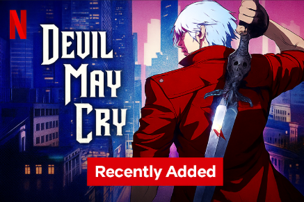
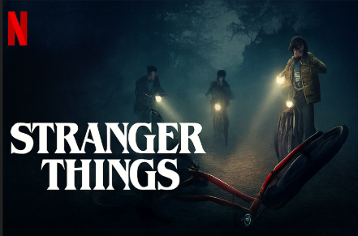
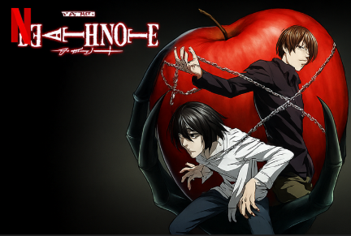

# NetFlix_Clone
## Date:
## Objective:
To create a modern, responsive navigation bar using CSS Flexbox, mimicking real-world websites like Netflix. This helps reinforce alignment, spacing, and layout structuring using Flexbox properties.

## Tasks:

#### 1. Structure the HTML Layout:
Use a ```<nav>``` tag as the main container.

Add a brand logo/title on the left using a ```<div> or <h1>```.

Add navigation links like Home, Menu, About, Contact, and Login using a ```<ul> with <li> and <a>```.

#### 2. Apply Flexbox for Layout:
Use display: flex on the ```<nav>``` container.

Use justify-content: space-between to align the logo and menu.

Use align-items: center to vertically center both sections.

Style list items with horizontal spacing using gap or margin.

#### 3. Style Like a Real-World Navbar:
Add background color (e.g., dark or gradient like Netflix/Zomato).

Style text with bold fonts, hover effects, and link styling.

Remove default ul and li styles (list-style: none, text-decoration: none).

#### 4. Bonus Enhancements:
Add a hover underline or button effect on links.

Make it responsive using flex-wrap or media queries.

Fix the nav bar to top with position: sticky.
## HTML Code:
```html
<!DOCTYPE html>
<html lang="en">
<head>
    <meta charset="UTF-8">
    <meta name="viewport" content="width=device-width, initial-scale=1.0">
    <link href="https://fonts.googleapis.com/css2?family=Bebas+Neue&display=swap" rel="stylesheet">
    <link rel="stylesheet" href="style.css">
    <title>Netflix</title>
</head>
<body>
    <header class="head">
        <div class="logo">
            <img src="data:image/png;base64,iVBORw0KGgoAAAANSUhEUgAAASIAAACuCAMAAAClZfCTAAAAyVBMVEUAAADlCRMAAAHnCBTpCBUDAAHQDhnjChM2CgvWEx4ZAACjFB3SEBcAAgDSFiKvFByZFBx4CQ7lDhrfERw5BAd+ERdfCAqSDxTdDx/rCBIxAACBCg4MAACaDxnEEBjpCxizDxhsCxBKSkqKDxYrBQhNCQwmAAAwCwzCFydFBwjKEiWUFx9fDhNwCg6NFyGdFyMfAACrEx69EBx6FBstAACkEBJFAgS+EBaaExawEBU9AAWgEiBvCQtjBgt3ChJKAgBjFBuTHCi2FiRHx3svAAAQgUlEQVR4nO1cDUPbttaWJTkiHw5BJiSmIQqDsKYNG2R0lN3Bve/+/496zzmSHDuxExfoGJ2eNqXYij4eny8dSWY/sYCdCAQFBAQEBAQEBAQEBAQEBAQEBAQEBAQEBAQEBAQEBAQEBAQEBAQEBAQEBAQEBAQEBAQEBAQEBAR8DyT4D/f/5xz/2l9if5cQUzHO43hHZdx/f1chuBuX662uy3aGM98jHuOF6mbXY+Dcl8KuxvD/OC+SNxnjyGJbjldWWe5unFC9Dut2Y7a+ntBfbC9OEl4HbA5ux5zVFnHFEs80jaeqRmYHUGzPMVdFUYzdXZey1XP8qqUaOlV4KrF7SFg83ktRHJdp5Dx/rEmpO0AOPZQkYTsBfYnjvQ+meqiVhUpixiuFDmiMy31FFYjLXXXDxAo2aNnTFeSR/fyxRei3pwvuG8PefGr17J3WZydScdL56K9todfqdxlp57JfV4bQbg1sI9f1ZaCyJ9J89kvbotf7VK0X8EwS9mv+vZUbdcI+p/B7r48N3haYgs+Xvi0Ln78muylCwWAHbSkQKosu8j6gaKZKWGRdyzZ05qYvRTWkUHJmTcZjTREsBcUi0bWNHGkpoqr6oigT5sI+70HmrmUp45V6gdcOXTWRaluTCf2/NpHOpIkyI8Z/rDmK+QIu49iMivTFHoaA6oQftKFLABXJTx2e5PLFUkPXIyG7zJoYxidTW3gbCsb1YFl/NDVlqLZIZbc5Rfi1irq00voIBZKzX6W9pGRaNwbAratHiJ69FrOk04emoC6pTfbZU4Ra2FUCKxRKZeObfRThqH/uOYqETOdr5QeKtB8VURSjTez08VFV0QRNmgc0jwk7z+oZgmJSrqUIWq2qTGYq+2DlY5BXpos+tjgGGMWhr0X1rBChCTmLqH6gSfRvqLYELfXPYxQHKAqf7l6ziKLhpSgSSpwVb47zDnedFses05f1o0dFQydyvkuKXH2WokjVCqX5YB3zwDWoRFrj0fBqTpGVIotFmill+2JOqGvov9nIawdI2GKfENET8BSBkZDtzrphNvbNOor4d6AIW62qCgb1ASW6AUWsRJEpUMRWULutX8ycNY15J7cVKjvc71uLFIEeGyD7R6LoPJLeRulLWzRmT7nAKX2yl6K4RBF8R812U5T8vRQ1UrR6ivhNW+QcXeAYErCUK38pE1O2bypQliJN3bjaSdHfJUXRa0gRdHeQuxbTsvMFttTaNanIaX4LRUqCbVPD5hRtRTNZTlEhwikM2l9cO/2cos2qQOlfQdHYXEfG8/FIHod9EbmLaF1B+LTXo5VsEX5WLnrcTZEyRvUG3bMSBt3f7INa/JrfOQSfYivJ7rE83Rj8VqZIKzEblOs66w7mthsvoYjHq/wpmS9Yjh+AJAgbF0UDGzt/A0VE03iRMDeL3EURxBUPFfXBM4lL2YBjnUv6cKu0owhCl/Rk66aLM15kizgbGm+LVPsOw6pBRAwhSekxfw5FaNb4fopQLTccpptno1tdz2L4sfbGJgPFxw7h9DIpUSRlNF5WdfWltgiu37VyD2+OoOBNC1QPmgQZQo+f7J/pb1MUrTrEz26PZrSWD+Wkh2XJUeNyEyhF3hzLIVsnSkoUQYn0pJwMwRQI5QxeQhFJ8630UqTuJyRVOPOQRqp0yeKkpsZi5VsUKb10eZydigYPYoMiTnxTKsQzBN859pOYSAytGhamot4WKaCoXFlM03f2MikiApapvSN1pMG6rSTO9sD8SflxwuNnKVokvzKXxtutaNGhs1lOLwvpOJfARD5A0Xzfhy55ueZo7dHIFq0rowwZGbUXKRqpWt9LkYFhPGqF0zYUJHPO6jJQ+yhSvQ63CbU9tmjGNp+8z8cUlK+kaE4TG0hRXuRlHg1F8cJGishKe3IrBfCDszMJE9v4eRQpAZpGadhvNNfVXT/Oo0iiqHw/p6jao71CXAQ4TdE0Iy9Cf3Fahx5ttJecOooiaQ4pFfwjUARSlLBbyqZgZkpJVwpMdnrcjKEqjyay3iWvU7Tk76XohXM0hskr9ogJUQyEVOTDWIjEGszxXRXbigaadtTIFr0DKaI8cWea4bAyqfzcSUj0bi+gKJKr54SO/0iK0CKDwYYZTkRJ8zzUnjWZe9RQhENKf+fYvd0UFUW1prE3psh6q4TNU4g8dFTIKqjoGhfXnkkR1pRdUP2bidlS6CghLir0kVellZtRhPmK7+jR4O7M+Mm0sqlyOb3he6f49RSBtZcrWlzaIUVwR846naurq8vLy7vj0+Pjg4r1qIZSBGqgH34tTvOHhSpegaJrmHWIwvgUTER3Lr0XUOXRQGdNSsYs3ZaigkeL0r5HG/58qnCiDaVIoB3Nipi6ki/2aIiET9pFEYA226e0KNiIoyqKsshAXAUkp576CinCO1kWufxXlIn04NkUYYOKnq5DdF+o4sUUwUi+mvVkNpK4SNXUEtV4NOh0Hz1BPgOtMNe4GGhcGlGi+UrvnkkRcUOBnX3E+JRflSK4PR9HedAIUdJ4XrPJpBlFAC1wEsJZumOmL1C9nYPAK5k+fSZFylZgjUSZotcx14DJKs8agV5rDGr25qyrKdJa0bI4dBI9eoUtWmcdhdM2P7T0+RQpSVOEdd5avqoU4T6RJ7+6iE9VPzJWuYGiAUXRfc8toIj2HUqRF5NtRRPEjf+fFFI/21wTyeL72SK0Old+jBhDTvdtBimi7NFUNnrwa0wwCWFtH7BXeDRhx5QL7wvMNe0myLLCYlFui17Fo1EK6ovbGQDuU2wn0Xdhg6KL8zy7swKKdi4S2aUc4TXzBRQJKbXWEblGUt5XNte0o2i9tqUqw9SGFIlRx0fUavwHhI71iqaIIqcXuKZQlVxoaouiDP0MOEhjP3L6qhRBt099GIwP5D/Pp8jIUb5PJzIXO20RtqY90jTV4+dLERrs3mpaQPd1KeJs5HsNbWXjq4o6GlGkJFB0YuxWCgmalsqd5rr14cOHI8Kff57/ef3sCQhERWr8WNfBV7BFCb9q+UwR5hv1E6udeW+hZK5VZEas0xbWo0d6XiFF5ZTaPrx9Ss3hPDegmE3TU1oTbYiy0wcpYl/Bt5ALlt002qFo7yRfZHEfrVOyoCDjOdu/xphXvkkRX+rMoAVWWZq74fdO0VJGkd9mRjMQ3L7XdKpfVrRsRPs9cY0Zl1F+EIo4O5Qq37ZJcWrrqnl4vU0ROxO05TaK1ps+3zlFi9So/HELmqg/PY+iCCkCqdQmwv0lMp+mvnOK2JlxG52Usp5IoKtpSFHJowErtPw2lUoVZgNRvUf7xy8SUdbsqi/RAUH4nio7DVEq/b2x1y9TRFLERlvbqt+tFBFFvxlFm4wg7ov8BFNfNFmrrqOIL5TY2M/4TinCY1WcT1bSZjVNFKn8PEJr8hxb5Cli04Ize88U2XX3ExAhZAdEqZBNwI0Lz6UIujXUPxJFM4HREG4pisZT3xkVzZra622KgIn1nqB3ThHunZmnuG2PshLiFz8RsZmJRhTFlRTFM1M2RtseTWmFO4gdyfmPJC6fk3tFj4anfny1+S4ml4GuoYjOxHyhG5QkHZ9etQ2tbUpQkwtX1z6OqjwaLc3tkSLcFH+4pc2TSdlNvKYUgRykT4/L+XxxfHd505n4Fuy22hpFY8mdX0JTIjuDEEnSDjVMiXyasEYnMKspOi0uzVUrmnBb8CdXf/x3+Xg+vBic3R5+/MxeV4rKiiYNQOu012vdrw67Z4Ph8GAnRfD9C/+0wVrPOZvrzO3HMiku8sT7syKVFMGkpnygrNIWZb0vs9W03x6nWkq3ivpQFtxXpcguHzmJcu3Jc6qzPrqeTP1I6PQFzPmlyjJjskxnXcabOLUqWwTCd5SvMtZRpLTIJGC9cqGVhl58N0XDcz+47dWPmJbmkSK2S9Ee89lZpq9JqqDfNA9RWfvORk7fTBE9lctWyadVUiTtWiMdGqQfwmQbG/pfmSKF4zVuRdKmzs+Z26xbI0WrPBTK7FaOy7bdrKajTAxZzPdSVOHR7BsDDkunOysPW1l+3BKwXWoWD+UG/b5rKmkpKt0/0oK2PWg5Pql2LRwpEnbRTkQ27SPc73AlO7cdq6IIB7/Qbt4KtAxtyUOFOx4FPt6pN2Q7sT2NjWkcSy1UFUU7DlsJu8+4XD0r7bvmvKyIQJFdozZp5dk5eovAwLh1lsit/5KeEFStotELBzi7JSrw1G7U7tgDH0vtc6lCLeyrH76Fomzkr07akUscNKYIn+psa6DHOtO03oq79zmPN6SIvgXPVddIEeWvSAatwFp6ZGR/1FIU2yMWB2Paho6FyTijhsT9/FC3uWUNlvYrzDUFgqwrClsDmx3Zg2HMtqo/Nr5H2ZBtivURirzIYJJZLUX03PGcfhR5A+RpssvldRRx+7aKES6+WuFLF5woSthFrh2mdbmPn2qK7OGUpc7yLbj7KaKug6mYbUSTSFGWCXR90h62KhFx3W632vDptfvLqt7REx5gNGTcqi+x4xNkplaKOL0Ro9OnHYcS0yC3zL/sYzHO/BD0UYP9IZtr+pYKPI8/Fevdbzspoi6j89dGz7YauPnP2ejiYvh0ff54wNjGBsPOaY5OlZ7R2x7+Nzjr3h6uVtNWD0IwjXTB4Iw2KLd1tijG4+ZPGi06bgWVNk7E1xiggfLjlf584g6UPRotEnErSHyUGZVX1bUTI6KIPAS92kLigQpcih2P263pdPXw9XrzNShFSvBFC1t5LHqxjJtHbCFZG694Mul0bq7ujhfz5eNvw9HXL/fTVqu9zCmS0gqa92hxMvkrgxkZhtJS3LsMGpJ0nh9LUem86QTEvVBARSPfIuP/tRkRNIsoRcRPjBRl0ugUOVnNHr6OPlwv58d3Nzu2ozTJOTRNkm5iMnHizYYrF+kbem0GHj9YujjTyCzN3wwCRTtTSdsG8TDv5/1N51JEW3xwBcS/WYhNcSuaxhkfUZQkdOph8n9nF0+PJ4vLNSvct/02wIwHydrk5vj3kz+PcHGDfNchGkFrt/p+FZ8ixTOM5Gy0ATeanbCWNvLTQJE3t+AO0Kka3NXQux8yd4o0VxR3xtgqScxrNOU7gzqLDj7Ju+PPswEXy+Evg8NpD8yXHqy/w/E9GeTpUDDMY5PQkaGi2XMRZrQeabKYfpp9HT7OT/EdGfhiKXITtitx4fVbDd4k9b3gUlWxpYR6kfjrvldx53j+v6u1DUQKZ1pbIRJy0wdvIbYU0QleDTPns3w7ANxZ2xd7EJPFVqrXvaOvu+OHbwHbV8z68Dy15+w7PU/XU1Y0dvjruYRIBD0jeJu9oZGTIiFN2pv+1V3ytaLFzhDSPIbCeU6vRrBepvCqNVfPW4mSC3isjmFsiA+MgrvY8oVTy7WBwFF0ri/OUAWNcUuHO0BR4sHHw9HTckEKlY+Tr0fNc1tcZqHEytsxVOyHyxG7f9ykma8lin51Pzt3i+XT59m+F4XF+SaStxSDt4JTgH3F0Jxg+NbwQMQPhpjtXZS1r0TMvcC/DUm8+12eiNiatpi/qTH5Z4MyKG/ntd8WFD7tXbfOS/0bzXXFq0IDAgICAgICAgICAgICAgICAgICAgICAgICAgICAgICAgICAgICAgICAgICAgICAgICAgL+PfjprTvwT8dP/w/aBijRF77oRAAAAABJRU5ErkJggg==" alt="logo" width="40%">
            <p>| Friday Feb 19</p>
        </div>
        <nav class="nav">
            <a href="">Home</a>
            <a href="">Movies</a>
            <a href="">TV Shows</a>
            <a href="">My List</a>
        </nav>
        <div class="log">
            <button class="login-btn">Login</button>
        </div>
    </header>
    <div class="content-wrap">
        <div class="content">
            <h2>SCI-FI | ADVENTURE | DRAMA</h2>
            <p class="tagline">A team of explorers embarks on a daring mission to travel beyond our galaxy, seeking a new home for mankind</p>
        </div>
        <div class="btns">
            <button type="button" class="btn" style="background-color: #e40a13;">Stream Now</button>
            <button type="button" class="btn">Add to Watchlish</button>
        </div>
    </div>
    <h3><div class="line">|</div> Watch More Movies</h3>
    <div class="cards">
        <div class="card">
            
        </div>
        <div class="card">
            
        </div>
        <div class="card">
            
        </div>
        <div class="card">
            
        </div>
    </div>
</body>
</html>
```
## CSS Code:
```css
*{
    margin: 0;
    box-sizing: border-box;
    background-color: black;
    color: white;
    font-family: 'Bebas Neue', sans-serif;
    letter-spacing: 1px;
    font-size: 28px;
}

.head{
    display: flex;
    justify-content: space-around;
}

.logo{
    display: flex;
    margin-left: -20px;
}

.nav{
    display: flex;
    margin-left: -180px;
}

p{
    margin-top: 8px;
    align-self: center;
    font-weight: 300;
    font-size: 15px;
    color: rgba(255,255,255,0.7);
}

a{
    font-size: large;
    font-weight: 400;
    margin: 45px 15px 0px 15px;
    text-decoration: none;
}

.log{
    margin-left: 300px;
    display: flex;
}

.content-wrap {
    background-image: url('con.avif');
    background-size: cover;
    background-position: center;
    background-repeat: no-repeat;
    display: flex;
    flex-direction: column;
    row-gap: 10px;
}

.content{
    margin-top: 180px;
    color: white;
    text-align: center;
    padding: 70px 0px 10px 28px;
    background-color: rgba(0, 0, 0, 0.01);
    display: flex;
    flex-direction: column;
}

a:hover{
    font-weight: 600;
    transform: scale(1.02);
    transition:all 0.2s ease-in-out;
    text-decoration: underline;
    color: #e40a13;
}

.login-btn{
    width: 180%;
    margin: auto;
    height:35px;
    border: none;
    border-radius: 3px;
    font-size: medium;
    transition: all 0.2s ease-in-out;
}

.login-btn:hover{
    background-color: #e40a13;
    box-shadow: 2px 3px 8px rgba(255, 255, 255, 0.5);
    transform: scale(1.05);
}

h2{
    background-color: rgba(0, 0, 0, 0.01);
    color: rgba(32, 50, 67,0.89);
    text-align: left;
    padding-left: 30px;
}

.tagline{
    width:28%;
    background-color: rgba(0, 0, 0, 0.01);
    color: rgba(0,0,0,0.7);
    text-align: left;
    padding-left: 30px;
    align-self: flex-start;
}

.btns{
    margin-left: 4%;
    margin-bottom: 5px;
    background-color: rgba(0, 0, 0, 0.01);
}

.btn{
    font-size: x-large;
    margin: 0.1vh;
    border: none;
    transition: all 0.15s ease-in-out;
    border-radius: 5px;
}

.btn:hover{
    box-shadow: 2px 3px 8px rgba(34, 57, 73, 1);
    transform: scale(1.05);
}

h3{
    margin-left: 4%;
    font-size: x-large;
    font-weight: 300;
}

.line{
    display: inline;
    color: #e40a13;
}

.cards {
    margin-top: 3vh;
    margin-left: 6vw;
    width: 80%;
    display: flex;
    justify-content: space-between;
}

.card {
    width: 20%;
}

.card > img {
    width: 80%;
    height: 100px;
}

.card > img:hover{
    transform: scale(1.15);
    transition: all 0.3s ease-in-out;
}

@media (max-width: 600px) {
    * {
        font-size: 20px;
    }

    .head {
        flex-direction: column;
        align-items: center;
    }

    .nav {
        flex-direction: column;
        align-items: center;
        margin-left: 0;
    }

    .log {
        margin-left: 0;
        flex-direction: column;
        align-items: center;
    }

    .logo {
        justify-content: center;
    }

    a {
        margin: 10px;
        font-size: medium;
    }

    .login-btn {
        width: 100%;
        font-size: 16px;
    }

    .content {
        margin-top: 80px;
        padding: 20px;
    }

    .tagline, h2 {
        width: 100%;
        font-size: 18px;
        text-align: center;
    }

    .btns {
        margin-left: 0;
        display: flex;
        flex-direction: column;
        align-items: center;
    }

    .btn {
        width: 80%;
        margin: 5px 0;
    }

    .cards {
        flex-direction: column;
        align-items: center;
    }

    .card {
        width: 80%;
        margin-bottom: 20px;
    }

    .card > img {
        width: 100%;
        height: auto;
    }

    h3 {
        margin-left: 0;
        text-align: center;
    }
}
```
## Output:


## Result:
A modern, responsive navigation bar using CSS Flexbox, mimicking real-world websites like Netflix. This helps reinforce alignment, spacing, and layout structuring using Flexbox properties is created successfully.
